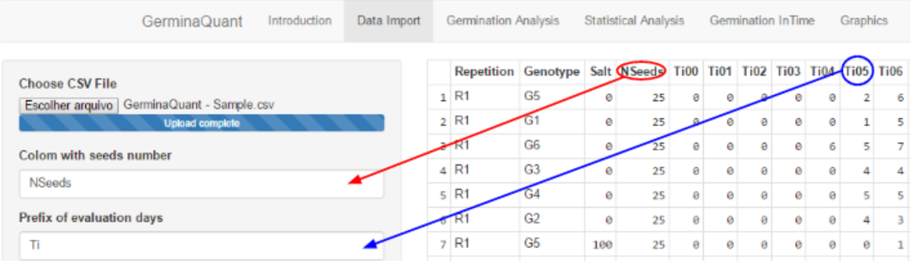
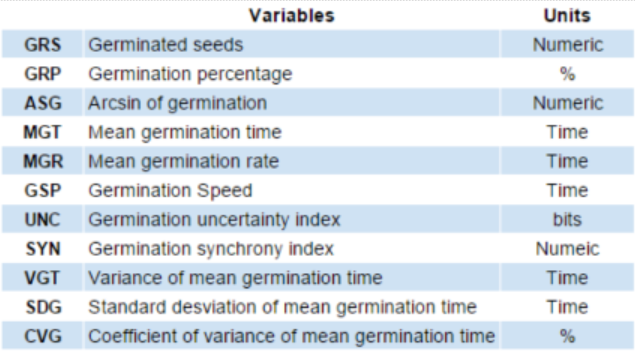
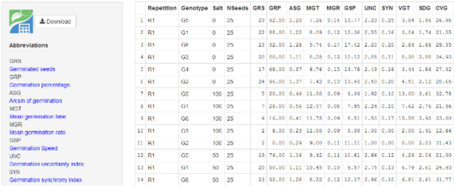
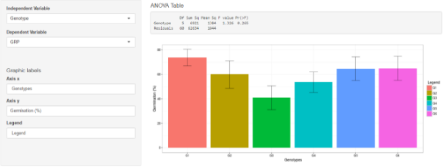
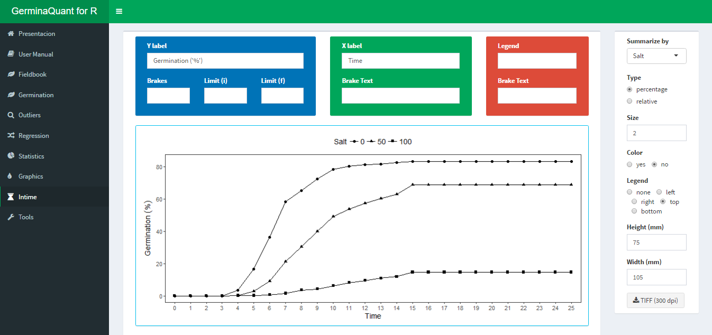
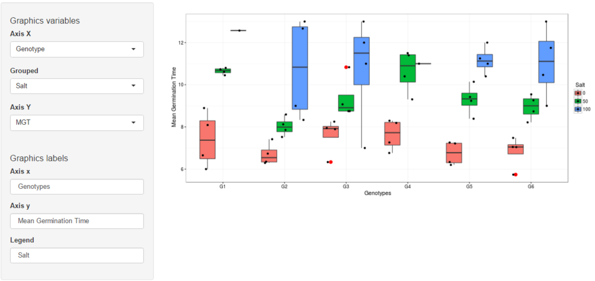

# GerminaQuant data processing

## Field Book

For using the GerminaQuant app is necessary that you have a data with germination values. You can use a data [sample](https://docs.google.com/spreadsheets/d/1QziIXGOwb8cl3GaARJq6Ez6aU7vND_UHKJnFcAKx0VI/edit#gid=667855537) for use the software in the following link: GerminaQuant Data Sample. The document should be in "csv" format. In case for use the sample, open the link and download the data in csv format.

Files >> Download >> Comma Separated Values (.csv, current sheet) >> "GerminaQuant - Sample.csv"

If you have a google account you can clone the document for you and edit it online and download for your own analysis.

## Import Data

When you have your field book, you can go [GerminaQuant](https://flavjack.shinyapps.io/germinaquant/) and go "Data Import" tab.

```{r fig.align='center', echo=FALSE, include=identical(knitr:::pandoc_to(), 'html')}

```

Choose the file in "csv" format will be analysed. There are two case that will have default values if you use the . "Column with seeds number" you have to write the name of the column containing the information of the number of seed sown in each experimental unit , "Prefix of evaluation days" you have to put the prefix of the name called for the day for evaluate the germination time lapse. 

```{r fig.align='center', echo=FALSE, include=identical(knitr:::pandoc_to(), 'html')}
knitr::include_graphics('img/csv.png')
```

Below of the parameter for evaluation, you will find the option to select the parameter for the "csv" format file, in such way the file  should have a table form.


## Germination analysis

If the parameter in the "Import Data" tab are correct, in "Germination analysis" tab will be appear the values of the eleven germination variables for each experimental unit.

```{r fig.align='center', echo=FALSE, include=identical(knitr:::pandoc_to(), 'html')}

```

GerminaQuant app allow to download the file in "csv" format with the calculation of the germination variables.

```{r fig.align='center', echo=FALSE, include=identical(knitr:::pandoc_to(), 'html')}

```

## Statistical analysis

In this tab, the app perform a unifactor variance analysis, calculate the statistical description of the factor, the mean differences through three mean test: Tukey, Student Newman Keuls and Duncan and made the graphic for the chosen variable.

```{r fig.align='center', echo=FALSE, include=identical(knitr:::pandoc_to(), 'html')}

```

Remember, the independiente variables will be the factor in your field book and the dependent variable will be any of the eleven of germination variables. Automatically the app will generate the graph for the variable chosen and give the mean comparison test. The axis label can be edited manually filling the case in the "Graphics labels" section. The bar graphs represent the mean and central line the standard error.

## Germination in Time

This Tab allows to visualise the germination process for each factor included in the field book.

```{r fig.align='center', echo=FALSE, include=identical(knitr:::pandoc_to(), 'html')}

```

The app give two graphics, the first is the germination in percentage in time lapse and the second the relative germination that calculate the germination according the total number of seed germinated.

## Box Plot

This section allows to plot the distribution of the germination observation through the box plot (outliers values and overlapping values) and allows to put label in the graph. In the section "Graphics variables", "Axis X" and "Grouped" you should choose between the factor in the the field book, are recommended in the "Axis X" you should choose the factor with more level and "Grouped" the factor with less levels, and the "Axis Y" any of the eleven germination variables, in the case you have only one factor  "Axis X" and "Grouped" should have the same factor. The axis label can be edited manually filling the case in the "Graphics labels" section.

```{r fig.align='center', echo=FALSE, include=identical(knitr:::pandoc_to(), 'html')}

```

