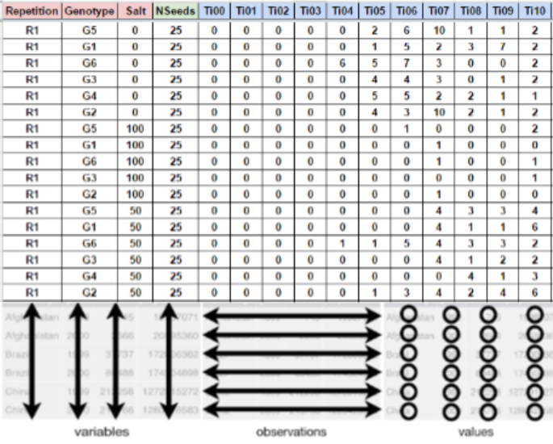

# Germination Field book

For correct analysis and fast data processing is important take account the data organization and the correct data collection of the germination process. This section we going to explain how you have to collect and organize your data.

For data example and layout, you can access and download GerminaQuant [spreadsheet](https://docs.google.com/spreadsheets/d/1QziIXGOwb8cl3GaARJq6Ez6aU7vND_UHKJnFcAKx0VI/edit#gid=667855537).


## Data Organization

The field book should have 3 essential parts; the factor columns (red). It will be use for the experiment treatment and statistical analysis and It will be according your experimental design; the seed number column (green) It will indicate the number of seed sown in each experimental units and the evaluation days column (blue), It will be fill with the germination values and It will be last according the experiment programmation and requirements. Figure \@ref(fig:dtorg)

You can design your own field book with different names in the column, remember you need at least  one column with factors or treatments, the column with the number of seed for each experimental unit and the evaluation days (with prefix) according to the time lapse of your experiment.


```{r dtorg, out.width='70%', fig.cap='Layout for germination evaluation process. The factor column (red) are according the experimental design. The seed number column (green) for the number of seed sown and the evaluation columns (blue) are for accounting the germination.',fig.align='center', echo=FALSE, include=identical(knitr:::pandoc_to(), 'html')}

```

## Data Collection

The evaluation of the germination process is obtained of the count of the germination in each experimental unit and It can be evaluated in time lapse of hours, days or months in continuous interval of the same length always beginning with the time zero (ei. Ti00) until the germination is complete and It can be when for 5 evaluation collection the values of germination are constant or according the experimental design.

