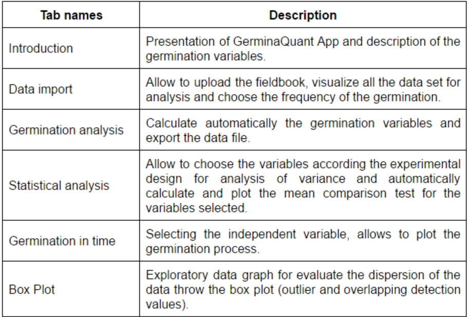

# Germination analysis

After fish the data collection of the germination process these information can be processed using GerminaQuant App. The web application can be used in any device connected to the internet in an interactive way. The application is compound in tabs (Table \@ref(fig:tabs)) that allow to made the analysis very easy. 

```{r tabs, out.width='70%', fig.cap='Name and description of each tab of GerminaQuant App for evaluate and analyze the  germination process.',fig.align='center', echo=FALSE, include=identical(knitr:::pandoc_to(), 'html')}

```

## GerminaQuant Web Application

```{r app, echo=FALSE}

knitr::include_app("https://flavjack.shinyapps.io/germinaquant/")

```

