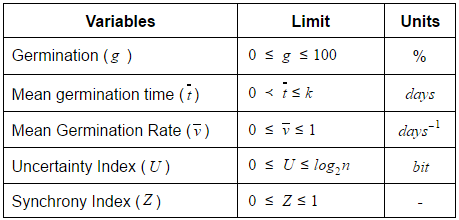

# Germination variables

## Germination (g)

According @GouveaLabouriau1983, the germinability of a sample of is the percentage of seeds in which the seed germination process comes to the end, in experimental conditions by the seminal intrauterine growth resulting protrusion (or emergence) of a living embryo. In general, it is presented as percentage, accompanied by some degree of dispersion, but it is possible to use proportions to one or more samples may be subjected to statistical tests [@CARVALHO2005].

$$ g=\left(\frac{\sum_{i=1}^kn_1}{N}\right)100 $$
  
**Where:** n~i~: number of germinated seed in the i^th^ time; N: total number of seed in each experimental unit.

## Mean Germination Time (t)

It was proposed by Haberlandt in 1875. It is calculated as the weighted average germination time. The number of germinated seeds at the intervals established for the collection of data is used as weight. It is expressed in terms of the same units of time used in the germination count [@Czabator1962].

$$ t=\frac{\sum_{i=1}^kn_it_i}{\sum_{i=1}^kn_i} $$

**Where** t~i~: Time of start of experiment tempo to observation (days or hours); n~i~:number of seed germinated the i^th^ time (number corresponding to i^th^ observation); k:the last day of germination.


## Mean Germination Rate (v)

The average speed of germination is defined as the reciprocal of the average time germination [@Ranal2006].

$$ v\ =\frac{1}{i} $$

**Where** t: mean germination time


## Uncertainty Index  (U)

The uncertainty index (U) is an adaptation of Shannon index measures the degree of uncertainty in predicting the informational entropy or uncertainty associated with the distribution of the relative frequency of germination [@GouveaLabouriau1983;@Labouriau1983]. Low values of U indicate frequencies with short peaks, i.e. the more concentrated the germination in time. Just a germinated seed changes the value of U. This means that u measures the degree of germination scattering.

$$ -\sum_{i=1}^kf_i\log_2f_i\ \ \Leftrightarrow\ \ \ f_i=\frac{n_i}{\sum_{i=1}^kn_i}  $$

**Where** f~i~: relative frequency of germination; n~i~:number of seed germinated in the  time  i number corresponding to i^th^ observation); k:the last day of germination.

## Synchrony Index (Z)

The Synchrony Index (Z) has been proposed to assess the degree of overlap between flowering individuals in a population. Adopting the idea expressed by PRIMACK (1980), Synchrony index is the synchrony of germination of one seed with other included in the same replication. When synchrony index = 1, germination of all the seeds occurs at the same time and when synchrony index = 0, at least two seeds can germinate one each time. Synchrony index produces a number if and only if there are two seeds finishing the seed germination process at the same time. Thus, the value of Z assessments is the grade of overlap between seed germination.

$$Z=\frac{\sum_{ }^{ }C_{n_1,2}}{N}\ \ \Leftrightarrow\ \ C_{n_1,2}=\frac{n_i\left(n_i-1\right)}{2}\ \ \Leftrightarrow\ \ N=\frac{\sum_{ }^{ }n_i\left(\sum_{ }^{ }n_i-1\right)}{2}$$

**Where** C~n~1~,2: combination of germinated seeds in i^th^ time; n~i~:number of germinated seed in the time i.


Table 01 Limits of the each germination variable; n: number of total seed in germination condition.


```{r fig.align='center', echo=FALSE, include=identical(knitr:::pandoc_to(), 'html')}

```

