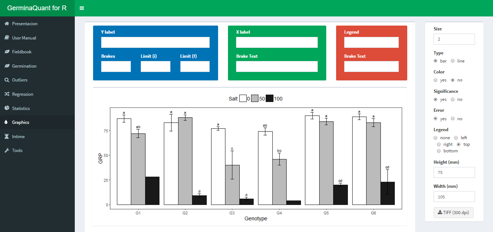

# GerminaQuant data processing

## Prepare you field book

For using the GerminaQuant is necessary that you have a data with germination values. You can use a following data as an example [data](https://docs.google.com/spreadsheets/d/1QziIXGOwb8cl3GaARJq6Ez6aU7vND_UHKJnFcAKx0VI/edit#gid=667855537). If you have a Google account you can clone the document and edit it online and download for your own analysis.

## Field book

When you have your field book, you can go [GerminaQuant for R](https://flavjack.shinyapps.io/germinaquant/) and go "Fieldbook" tab. Figure \@ref(fig:impdt).

```{r impdt, out.width='100%', fig.cap= "Fieldbook interface for import your data", fig.align='center'}
knitr::include_graphics('img/impdt.png')
```

You can paste a Google spread sheet URL or upload a local file in xlsx format. In "Seeds (col name)" you have to write the name of the column containing the information of the number of seed sown in each experimental unit, for "Evaluations (prefix)" you have to put the prefix of the names for the evaluated days from the germination time lapse. 

## Germination

If the parameter in the "Fieldbook" tab are correct, in "Germination" tab will be performed and the values of the germination indices for each experimental unit will be shown. Table \@ref(tab:varsum). GerminaQuant allows to copy or downloading the file in "csv" or "xlsx" format with the calculation of the germination variables. Figure \@ref(fig:dwl)

```{r dwl, fig.cap='Dowload option for the calculated variables', fig.align='center',out.width='100%'}
knitr::include_graphics('img/dtdown.png')
```

## Statistical

The application can perform a factorial analysis according you experimental design (crd, crbd or lsd), and calculate the analysis of variance and the mean differences through Student Newman Keuls, Tukey or Duncan test according the chosen variable.

```{r stat,  fig.cap="Statitical analysis with ANOVA and mean comparison test", fig.align='center', out.width='100%'}
knitr::include_graphics('img/stat.png')
```

## Graphics

Automatically after performed the statistical analysis the application will generate the graphs for the variable chosen with the mean comparison test. The interface allows customized bar or line plot and export in "tiff" format for publication quality.


```{r plot,  fig.cap="Customized interface for bar or line plot", fig.align='center', out.width='100%'}

```


## InTime

This Tab allows to visualize the germination process according the experimental factors. The interface allows customized the graphic. Figure \@ref(fig:gtime)

```{r gtime,  fig.cap='Germination in time plot', fig.align='center', out.width='100%'}
knitr::include_graphics('img/gtime.png')
```

The application allows to plot two type of graphics, the first is the germination in percentage in time lapse and the second the relative germination that calculate the germination according the total number of  germinated seeds.
