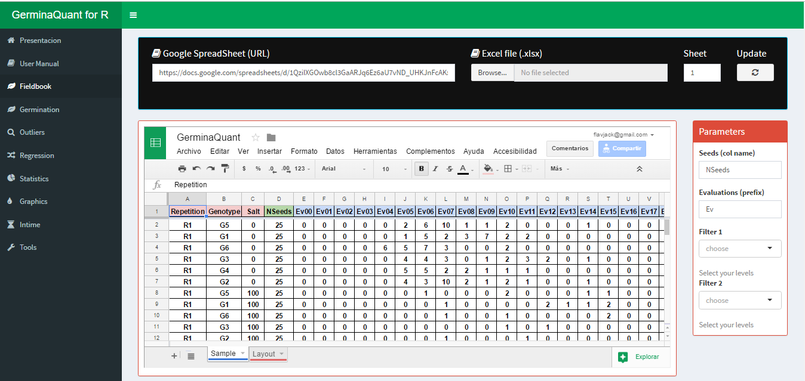
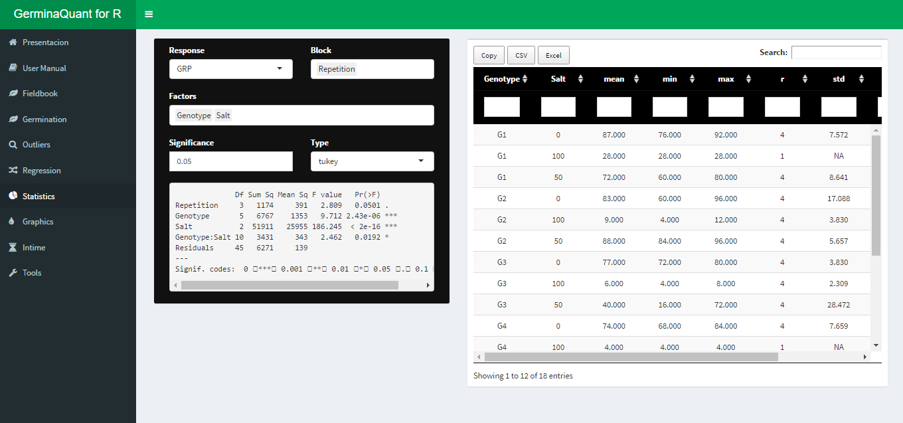
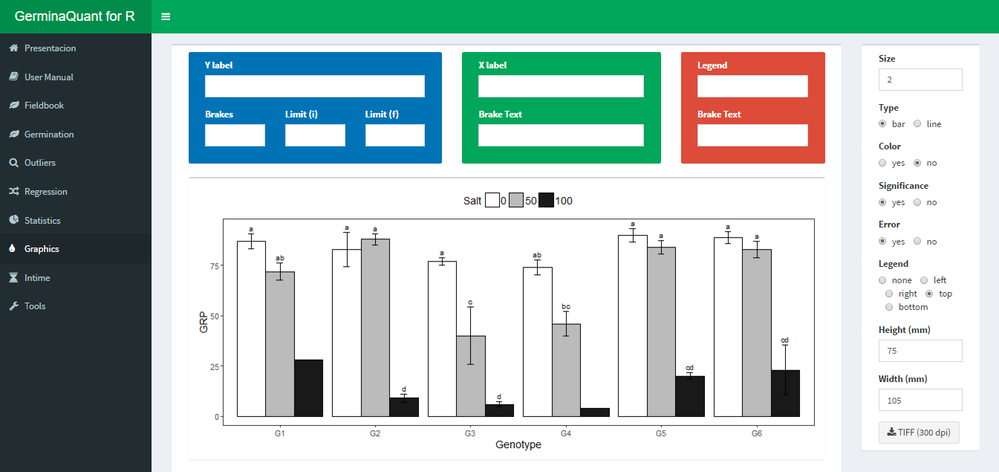

--- 
title: GerminaQuant for R user manual 
author: 
  - "Flavio Lozano-Isla $^{1}$, Omar Benites Alfaro $^{2}$, Denise Garcia de Santana $^{3}$, Marli A. Ranal $^{4}$, Marcelo Francisco Pompelli $^{5}$"
  - "$^{1}$ Universidade Federal Rural de Pernambuco, Brazil. email: flavjack@gmail.com"
  - "$^{2}$ Centro Internacional de la Papa (CIP), Peru. email: obacc07@gmail.com"
  - "$^{3}$ Universidade Federal de Uberlandia, Brazil. email: denise.santana@ufu.br"
  - "$^{4}$ Universidade Federal de Uberlandia, Brazil. email: ranal@ufu.br"
  - "$^{5}$ Universidade Federal de Pernambuco, Brazil. email: mpompelli@gmail.com"
description: A guide for analisis of germination variables and usage of GerminaQuant for R
date: '`r Sys.Date()`'
github-repo: flavjack/GerminaQuant-usm/issues
cover-image: files/cover.jpg
url: https\://www.lozanoisla.com
favicon: files/icons/favicon.png
site: bookdown::bookdown_site
documentclass: book
bookdown::gitbook:
output: 
  bookdown::word_document2: 
    reference_docx: cnfg/style_article.docx
always_allow_html: yes
link-citations: true
colorlinks: yes
bibliography: [cnfg/book.bib, cnfg/pkgs.bib]
csl: https://www.zotero.org/styles/apa
---

```{r setup, include=FALSE}
# source("cnfg/debug.r")
source("cnfg/setup.r")
```

# Introduction {-}

```{r icon, out.width='35%', fig.align='center'}

```

**GerminaQuant for R** allows make the calculation of the germination variables incredibly easy in an interactive applications build in R [@R-base], based in GerminaR and Shiny R package [@R-shiny] . GerminaQuant app is reactive!. Outputs change instantly as users modify inputs. The principal features of the application allows to calculate the princiapal germination Variables, statistical analysis and easy way to plot the results.

## Citation {-}

Lozano-Isla, F., Benites-Alfaro, O. E., & Pompelli, M. F. (2019). GerminaR: An R package for germination analysis with the interactive web application “GerminaQuant for R.” Ecological Research, 34(2), 339–346. https://doi.org/10.1111/1440-1703.1275

## Patent {-}

Lozano-Isla, F., Benites Alfaro, O., & Pompelli, M. F. (2016). GerminaQuant for R (Patent No. BR 51 2016 001327-3). https://flavjack.shinyapps.io/germinaquant/

# Seed germination process

The physiology and seed technology have provided valuable tools for the production of high quality seed and treatments and storage conditions [@Marcos-Filho1998]. In basic research, the seeds are studied exhaustively, and the approach of its biology is performed to fully exploit the dormancy and germination [@Penfield2009]. An important tool for indicate the performance of a seed lot is the precise quantification of germination through accurate analysis of the cumulative germination data [@Joosen2010]. Time, velocity, homogeneity, uncertainty and synchrony are measurements that inform the dynamics of the germination process. It is interesting not only for physiologists and seed technologists, but also for environmentalists, since it is possible to predict the degree of success of the species, based on the seed crop ability to redistribute germination over time, allowing the recruitment of part of the seedlings formed [@Ranal2006].

# Germination analysis

After the data collection, the information can be processed using GerminaQuant App. The web application can be used in any device, connected to the internet, in an interactive way. The application is compound in tabs (Table \@ref(tab:tabs)) that allow to make the analysis very easy.


```{r tabs}
tab <- data.frame( 
  
"Tabs" = c(
  "Presentation",
  "User Manual",
  "Fieldbook", 
  "Germination", 
  "Boxplot",
  #"Regression",
  "Statistics", 
  "Graphics",
  "InTime",
  "Tools"), 

"Description" = c(
  'Presentation of the aplication, principal characteristics and constributors',
  "User manual explain the meaning of each indice and how to collect and process your data",
  "Interface to upload the field book and choose the parameter for the germination analisys, GerminaQuant allows to upload tha data from google sheet or excel file",
  "Calculate automatically the germination variables and export the data file.",
  "Interface to explore your data and their distribution",
  #"Allows to made the regression analisys for the variables used in the experiment",
  "Interface to choose the variables according the experimental design for analysis of variance and summarise the information according the principal mean comparison test",
  "Graphic the mean comparison test for the variables selected in the statistical analisys and plot the information in customized bar or line plot.", 
  "Selecting the factor from your experiment, allows plotting the germination process in time.",
  "Tool for calculte the osmotic potencial for any salt or PEG for germination experiments")
)

knitr::kable(
  tab, 
  booktabs = TRUE,
  caption = 'Name and description of each tab of GerminaQuant to evaluate and analyze the germination process'
  )
```

# GerminaQuant data processing

## Prepare you field book

For using the GerminaQuant is necessary that you have a data with germination values. You can use a following data as an example [data](https://docs.google.com/spreadsheets/d/1QziIXGOwb8cl3GaARJq6Ez6aU7vND_UHKJnFcAKx0VI/edit#gid=667855537). If you have a Google account you can clone the document and edit it online and download for your own analysis.

## Field book

When you have your field book, you can go [GerminaQuant for R](https://flavjack.shinyapps.io/germinaquant/) and go "Fieldbook" tab. Figure \@ref(fig:impdt).

```{r impdt, out.width='100%', fig.cap= "Fieldbook interface for import your data", fig.align='center'}

```

You can paste a Google spread sheet URL or upload a local file in xlsx format. In "Seeds (col name)" you have to write the name of the column containing the information of the number of seed sown in each experimental unit, for "Evaluations (prefix)" you have to put the prefix of the names for the evaluated days from the germination time lapse. 

## Germination

If the parameter in the "Fieldbook" tab are correct, in "Germination" tab will be performed and the values of the germination indices for each experimental unit will be shown. GerminaQuant allows to copy or downloading the file in "csv" or "xlsx" format with the calculation of the germination variables. Figure \@ref(fig:dwl)

```{r dwl, fig.cap='Dowload option for the calculated variables', fig.align='center',out.width='100%'}
knitr::include_graphics('files/dtdown.png')
```

## Statistical

The application can perform a factorial analysis according you experimental design (crd, crbd or lsd), and calculate the analysis of variance and the mean differences through Student Newman Keuls, Tukey or Duncan test according the chosen variable.

```{r stat,  fig.cap="Statitical analysis with ANOVA and mean comparison test", fig.align='center', out.width='100%'}

```

## Graphics

Automatically after performed the statistical analysis the application will generate the graphs for the variable chosen with the mean comparison test. The interface allows customized bar or line plot and export in "tiff" format for publication quality.


```{r plot,  fig.cap="Customized interface for bar or line plot", fig.align='center', out.width='100%'}

```

## InTime

This Tab allows to visualize the germination process according the experimental factors. The interface allows customized the graphic. Figure \@ref(fig:gtime)

```{r gtime,  fig.cap='Germination in time plot', fig.align='center', out.width='100%'}
knitr::include_graphics('files/gtime.png')
```

The application allows to plot two type of graphics, the first is the germination in percentage in time lapse and the second the relative germination that calculate the germination according the total number of  germinated seeds.

# Germination field book

For correct analysis and fast data processing is important to take into account the data organization and the correct data collection of the germination process. In this section, we are going to explain how can you collect and organize your data.

For data example and layout, you can access and download GerminaQuant [spreadsheet](https://docs.google.com/spreadsheets/d/1QziIXGOwb8cl3GaARJq6Ez6aU7vND_UHKJnFcAKx0VI/edit#gid=667855537).


## Data Organization

The field book should have three essential parts.(1) The factor columns (red), according to the experimental design;(2) the seed number column, indicate the number of seeds sown in each experimental unit (green) and (3) the evaluation columns with the germination values (blue) (Figure \@ref(fig:dtorg)). You can design your own field book with different names in the column according your experimental design.


```{r dtorg, fig.cap='Layout for germination evaluation process. The factor column (red) are according the experimental design. The seed number column (green) for the number of seed sown and the evaluation columns (blue) for accounting the germination.',fig.align='center', out.width='100%'}
knitr::include_graphics('files/dtorg.png')
```

## Data Collection

The evaluation of the germination process is obtained of the count of the germination in each experimental unit and It can be evaluated in time lapse of hours, days or months in continuous interval of the same length always beginning with the time zero (ei. Ti00), until the end of the germination process or according to the researcher criteria.


```{r chunk_name, child = 'cnfg/code.Rmd'}
``` 


`r if (knitr::is_html_output()){'
# References {-}
<div id="refs"></div>'}`

`r if (!knitr::is_html_output()){'
# References {-}
<div id="refs"></div>'}`
